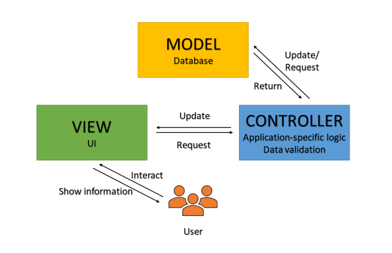

# UWC 2.0 
UWC 2.0 is a project about Urban waste management which based on an idea from a Vietnamese professor working at Norway. Our mission consists of analysing requirement, designing modelling system along with Architecture and implementing the demo web interface (including routing optimization). 
In this project we have 4 session:

## 1. Requirement Elicitation: 
- Identify the context, stakeholders and scope.
- Describing both **functional** and **non-functional requirements**.
- Draw **use-case diagram**.
## 2. Design System Modeling:
- Analyse and draw **Activity Diagram**
- Design **Sequence Diagram** for showing the sequence of messages passed between objects, such as _Coordination, Login, Dashboard, etc_
- Illustrate the model of the objects that make up the system, display the relationships between the objects, and describe what those objects do and the services that they provide using **Class Diagram**.
## 3. Architecture Design:
This project is implemented upon **MVC Architecture**. See the picture below:

Then using **Component Diagram** to show the structure of the software system, which describes the software components, their interfaces, and their dependencies. Some main features are _Login, Dashboard, Coordination and Communication_

## 4. Demo Implementation
Source code is above the repository, using **HTML**, **CSS (Boostrap)** and a little bit **Javascript**.

---

### ***Thanks to visit this Repo. Have a good time !!*** 
